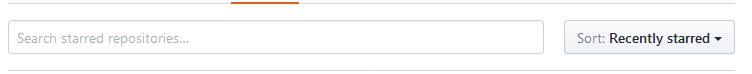

# UX

## SPRINT 02 - RETOS DE CÓDIGO

## LABORATORIA

#### Objetivo:

Identificar los elemntos UX y UI de la página de Laboratoria. 

#### Flujo de trabajo:

1. Identificar y analizar todos los elementos UI.
2. Identificar y analizar todos los elementos UX.
3. Explicarlos e ilustrarlos en este documento.

## OBJETIVOS DE NEGOCIO:
	*RECLUTAR EL MAYOR NÚMERO DE POSTULANTES
	*CONTACTAR EL MAYOR NÚMERO DE EMPRESAS CONTRATANTES
	*CONTACTAR EL MAYOR NÚMERO DE CLIENTES PARA CAPACITACIONES EMPRESARIALES
	*CONSOLIDAR LA REPUTACIÓN DEL PROYECTO		

### PÁGINA PRINCIPAL

#### BARRA DE NAVEGACIÓN.

##### ELEMENTOS UI
	*Barra superior horizontal con fondo en blanco.
	*Al centro distintivo gráfico principal: logo de Laboratoria.
	*Dos opciones de navegación en botón: Estudiantes y Empresas.
	*Fondo de botón en activo #f7b617 con letras en #000.
	*Fondo de botón hover # blanco con borde y letras en #f7b617.
	*La tipografía es la ofical de laboratoria sans-serif.

##### ELEMENTOS UX
	*Establece un primer contacto directo con sus dos nichos principales: estudiantes y empresas.
	*Al utilizar los colores  del logotipo refuerza la identidad de la marca.
	*Desde la barra de navegación se establece un estilo limpio y profesional.

#### COVER.

##### ELEMENTOS UI
	*Slogan como título principal, seguido del tagline.
	*Ambos centrados al centro en color blanco con fotografía en modo cover de fondo.
	*La fotografía ha sido editada y manipulada para mantener un solo estilo durante toda la navegación.
	*Icono que indica mayor navegación hacia abajo.

##### ELEMENTOS UX
	*La fotografía del cover presenta a una chica feliz en el momento de graduarse.
	*La imagen refleja la idea de un momento de triunfo y meta alcanzada.
	*La chica mira sonriente directamente a la cámara lo que crea un vínculo instantáneo con el usuario, como si le hablara a el.
	*El flare en la parte superior sirve de enlace con la barra superior y refureza la idea de luminosidad  y écito en el momento que viven las alumnas de la imagen.
	

#### CALL TO ACTION 1.

##### ELEMENTOS UI
	*Fondo blanco.
	*Titulo de sección en amarillo.
	*Titulo de artículo en negro y estilo bold.
	*Párrafo descriptivo en negro estilo light.
	*Boton call to action fondo amarillo #f7b617 con letras negro en estilo bold.
	*Todo con alineación al centro.
	 

##### ELEMENTOS UX
	*Dirigido a prospectos de estudiantes.
	*Llama dos veces a la acción (título y botón.)
	*Ofrece un servicio(aprende a programar) y hace una promesa (consigue un trabajo).
	*Presenta rápidamente a Laboratoria.
	*Los diferentes tamaños de letra permite hablar tanto a un usuario nuevo (explicación más larga) como a uno recurrente (una aspirante que regresa para comenzar su postulación).

#### TESTIMONIO EGRESADA.

##### ELEMENTOS UI
	*Fotografía de egresada.
	*Testimonio breve en tipografía en blanco y estilo normal.
	*Nombre de la egresada en tipografía en blanco y estilo bold.
	*Pie de foto presentandola como egresada de Laboratoria.
	*Todos los textos con alineación al centro.
	*El texto colocado ligeramente hacia la izquierda para no obstruir la imagen pero sin salir de la columna central que forman todos los parrafos de la página completa.

##### ELEMENTOS UX
	*La egresada es presentada en un ambiente y con una apariencia profesional pero que inspira rápidamente una relación con el ambiente tech(no es una oficina promedio tradicional).
	*La pose de la egresada nuevamente vuelve a dar la impresión de hablar directamente a las aspirantes.
	*El testimonio refleja como la egresada se ha convertido en parte de la comunidad tecnologica y que tiene tanto la capacidad como las oportunidades de desarrollar nuevos productos.

#### CALL TO ACTION 2.

##### ELEMENTOS UI
	*Fondo blanco.
	*Titulo de sección en amarillo.
	*Titulo de artículo en negro y estilo bold.
	*Párrafo descriptivo en negro estilo light.
	*Boton call to action fondo amarillo #f7b617 con letras negro en estilo bold.
	*Todo con alineación al centro.

##### ELEMENTOS UX
	*Dirigido a prospectos de empresas contratantes.
	*Llama a la acción (título y botón.)
	*Ofrece un servicio(aprende a programar) y hace una promesa (consigue un trabajo).
	*Describe rápidamente los procesos de selección y formación de Laboratoria.
	*Informa sobre la cantidad de empresas con las que ya participa.
	*Los diferentes tamaños de letra permite hablar tanto a un usuario nuevo (explicación más larga) como a uno recurrente (un empresario que regresa para mayor información).

#### TESTIMONIO EMPRESARIO.

##### ELEMENTOS UI
	*Fotografía de empresario.
	*Testimonio breve en tipografía en blanco y estilo normal.
	*Nombre de la egresada en tipografía en blanco y estilo bold.
	*Pie de foto presentando su posición profesional.
	*Todos los textos con alineación al centro.
	*El texto colocado ligeramente hacia la derecha para no obstruir la imagen pero sin salir de la columna central que forman todos los parrafos de la página completa

##### ELEMENTOS UX
	*El empresario da la impresión de estar hablando hacia un auditorio no visible en el cuadro lo que refuerza el sentido de invitación hacia otros empresarios a tambien contratar a las egresadas de Laboratoria.

#### CALL TO ACTION 3.

##### ELEMENTOS UI
	*Fondo blanco.
	*Titulo de sección en amarillo.
	*Titulo de artículo en negro y estilo bold.
	*Párrafo descriptivo en negro estilo light.
	*Boton call to action fondo amarillo #f7b617 con letras negro en estilo bold.
	*Todo con alineación al centro.

##### ELEMENTOS UX
	*Dirigido a prospectos para capacitaciones empresariales.
	*Llama a la acción (título y botón.)
	*Ofrece un servicio(desarrollar habilidades),
	*Describe rápidamente los servicios de capacitación empresarial de Laboratoria.
	*Informa sobre la variedad de cursos, las ventajas que ofrece tener empleados calificados en esas ramas y la cantidad de líderes empresariales que han sido capacitados.
	*Los diferentes tamaños de letra permite hablar tanto a un usuario nuevo (explicación más larga) como a uno recurrente (una empresa que regresa para mayor información).

#### TESTIMONIO CAPACITACIÓN.

##### ELEMENTOS UI
	*Fotografía de grupo en capacitación.
	*Testimonio breve en tipografía en blanco y estilo normal.
	*Nombre de la empresaria en tipografía en blanco y estilo bold.
	*Pie de foto presentando su posición profesional.
	*Todos los textos con alineación al centro.
	*El texto colocado ligeramente hacia la derecha para no obstruir la imagen pero sin salir de la columna central que forman todos los parrafos de la página completa

##### ELEMENTOS UX
	*Presenta un grupo mixto en capacitación que refleja un ambiente de interés, aprendizaje, inclusión y cordialidad. 

#### IMPACTO.

##### ELEMENTOS UI
	*Título de la sección.
	*Cuatro rectángulos amrillos en línea enmarcando cuatro indicadores de interés que demuestran el impacto de Laboratoria en tipografía negra en dos líneas (número y descripción).
	*Resalta los números con un tamaño tres veces mayor y en estilo bold sobre la descripción.
	*Testimono de Barack Obama en letras blancas, bold y alineadas al centro sobre una fotografía que presenta un panel de líderes de opinión a nivel mundial.
	
##### ELEMENTOS UX
	*Muestra cuatro idicadores claves sobre laboratoria.
	*Al ser números cerrados facilitan su recordación.
	*La fotografía con el testimonio demuestran la influencia mundial de laboratoria y refuerza la idea de que es un proyecto de primer nivel-

#### ALIANZAS.

##### ELEMENTOS UI
	*Titulo de la sección.
	*Fondo gris extra claro para diferenciarlo de las secciones contiguas.
	*Logotipo de seis empresas con las que Laboratoria tiene alizanzas.
	*Los logotipos se encuentran centrados dentro cuadros blancos y distribuidos en dos lineas de tres elementos cada una.
	*Al centro  de ambas lineas se encuentran los logotipos más famosos y faciles de reconocer.

##### ELEMENTOS UX
	*Se muestran empresas de talla mundial lo que hace a Laboratoria una de ellas.

#### RECONOCIMIENTOS.

##### ELEMENTOS UI
	*Titulo de la sección.
	*Fondo blanco.
	*Logotipo de tres reconocimientos que ha recibido Laboratoria a nivel internacional.
	*Los logotipos se encuentran centrados, con las mismas dimensiones y distribuidos en una sola línea.

##### ELEMENTOS UX
	*Los reconocimeintos reflejas tres aspectos importantes de Laboratoira: el interés por impulsar a las mujeres, su impacto en el mundo tecnológico y la busqueda por formentar la inovación.

#### MEDIOS.

##### ELEMENTOS UI
	*Titulo de la sección.
	*Fondo gris extra claro para diferenciarlo de las secciones contiguas.
	*Logotipo de seis momentos en los que Laboratoria ha tenido presencia en medios de alto perfil.
	*Debajo de los logotipos de cada medio se ofrece el título bajo el cual se realizo la cobertura en una o dos lineas alineadas al centro con letra en negro estilo normal.

##### ELEMENTOS UX
	*Esta sección continua reforzando la validación que tiene Laboratoria por parte de expertos en el tema.
	*Permite al usuario la oportunidad de buscar estas coberturas para mayor información y conocer otras opiniones al respecto.

#### BLOG.

##### ELEMENTOS UI
	*Titulo de la sección.
	*Continuando con el esquema de tres columnas al centro.
	*En cada columna se encuentra el enlace a una publicación del blog.
	*Cada enlace presenta: logotipo y titulo dondes se aloja, autor, imagen de portada, título del artículo, introducción y enlace para leer el resto.

##### ELEMENTOS UX
	*La selección de artículos muestran que es posible saber más sobre las metodologías de Laboratoria, su impacto social y su impacto en el mundo de la tecnologia.
	*Ademas es posible consultar entradas tanto en ingles como en español.

#### FOOTER.

##### ELEMENTOS UI
	*Fondo gris oscuro.
	*Tipografía en blanco.
	*Distribucion en dos columans, la izquierda tres ves mas ancha que la derecha.
	*Logotipo en su versión clara.
	*Párrafo descriptivo de Laboratoria.
	*Barra de utilidades.

##### ELEMENTOS UX
	*Refuerza los puntos más importantes de la descripción de Laboratoria.
	*Ofrece tres opciones para continuar el contacto.

### ESTUDIANTES

#### BARRA DE NAVEGACIÓN

##### ELEMENTOS UI
	*Logotipo en versión oscura al centro sobre fondo blanco.

##### ELEMENTOS UX
	*Ofrece la opción de regresar al principio pero se enfoca en el proceso de postulación.

####  COVER & CALL TO ACTION 5.

##### ELEMENTOS UI
	*Título y subtítulo en blanco sobre fotografia editada.
	*Botón con color de fondo amarillo y tipografía en negro estilo bold.
	*Todos los elementos alineados al centro.
	*Fotografía de fondo en modo cover.
	

##### ELEMENTOS UX
	*Tres call to action: Título, subtítulo y botón.
	*Promesa principal: Transforma tu futuro.
	*Escena de cuatro estudiantes felices que trabajan en equipor frente a una computadora con el logotipo de laboratoria en ella.
	*La fotografia transmite el sentimiento de trabajo en equipo y convivencia entre las estudiantes.

#### ASISTENCIA EN LÍNEA.

##### ELEMENTOS UI
	*Botón con icono blanco sobre fondo amarillo, alineado en la esquina inferior derecha..
	*Indica la opción de entrar al chat para mayor información y solución de problemas.
	*Al dar clic sobre él se expande una pestaña de lado derecho de fondo blanco con el nombre de Laboratorina en amarillo, con espacio para mostrar el dialogo con la usuaria.

##### ELEMENTOS UX
	*Transmite la confianza de poder consultar con alguien si durante el proceso de llenado se tiene dudas o dificultades.
	*Laboratorina es un nombre simpatico y la forma en que invita a interactuar es cordial y accesible.

#### DESCRIPCIÓN CONCEPTO.

##### ELEMENTOS UI
	*Título de la sección. Tipografía en negro, estilo bold.
	*Párrafo descriptivo. Tipografái en negro, estilo normal.
	*Textos alineados al centro vertical y horizontalmente.

##### ELEMENTOS UX
	*El título en forma de pregunta ayuda a las usuarias a identificar sus propias dudas y cuestionamientos con cada sección.
	*Remarca características, historia y promesas de Laboratoria.

#### DESCRIPCIÓN PROCESO.

##### ELEMENTOS UI
	*Fondo de la sección en gris extra claro para diferenciar del blanco predecesor.
	*Título de la sección. Tipografía en negro, estilo bold.
	*Párrafo descriptivo. Tipografái en negro, estilo normal.
	*Textos alineados al centro vertical y horizontalmente.
	*Cuadro descriptivo del programa dividido en dos secciones que representan el porcentaje aproximado de la duración de las etapas.
	*El cuadro esta limitado por un borde gris y los textos presentan una alineación a la izquierda

##### ELEMENTOS UX
	*Después de reafirmar el potencial de las mujeres en general y dirigirse a la usuaria en particular, en lugar de hacer una lista exahustiva y detalla de cada parte del programa, se enfoca en los puntos más importantes de forma clara, precisa y corta: duración y objetivos de cada etapa.

#### CALL TO ACTION 5.

##### ELEMENTOS UI
	*Título y subtítulo en blanco sobre fotografia editada.
	*Botón con color de fondo amarillo y tipografía en negro estilo bold.
	*Todos los elementos alineados al centro.
	*Fotografía de fondo en modo cover.

##### ELEMENTOS UX
	*La fotografía mantiene el profesionalismo de edición de las del resto de la página sin por ello restarle espontaneidad a la escena donde una mujer entusiamada sonríe mientras es observada por otra jóven.
	*La pregunta de la sección busca tocar el deseo de superación que se encuentra en las usuarias.

#### CRITERIOS DE SELECCIÓN.

##### ELEMENTOS UI
	*Título de la sección.
	*Listado ordenado de los requisitos.
	*Texto negro sobre fondo blanco, alineado a la izquierda.

##### ELEMENTOS UX
	*Son solo cuatro puntos, lo que atrae por no tratarse de una larga lista de requerimientos.
	*Las oraciones son breves y concisas para evitar confusiones.

#### PASOS PARA POSTULAR.

##### ELEMENTOS UI
	*Titulo de la sección.
	*Párrafo descriptivo.
	*Listado ordenado de pasos a seguir.
	*Tipografia negro sobre fondo gris extra claro.
	*Subtítulos en estilo bold y uppercase.
	*Texto alineado a la izquierda.
	*Botón de llamado a la acción fondo amarillo y texto en negro, bold y uppercase.

##### ELEMENTOS UX
	*Ofrece estadisticas en forma de testimonio pra reforzar la invitación.
	*Los pasos son pocos y resumidos lo que refuerza el sentimiento de facilidad para postular.
	*Nuevament el botón llama a comenzar el proceso en el momento sin necesidad de regresar al principio de la página.

#### CALENDARIO DE POSTULACIÓN.

##### ELEMENTOS UI
	*Como fondo una nueva fotografía de estudiantes festejando su graduación.
	*El t+itulo de la sección, esta vez en amarillo para resaltar y combinar con los elementos de la fotografía.
	*Cinco opciones de postulación, una por cada sede indicando las fechas de inicio.
	*Las opciones se presentan en rectangulos blancos, nombre de la sede en amarillo y fechas en negro.
	*Párrafo informativo en  letras blancas bajo la línea de opciones.

##### ELEMENTOS UX
	*Muestra otro momento feliz de las estudiantes de Laboratoria, en especifico durante la graduación asociandolo con una meta alcanzada.
	*Muestra todas las sedes al mismo nivel.
	*Informa sobre otras opciones de contacto en caso de no encontarse una fecha próxima de inicio de clases en la sede deseada.

#### FORMULARIO DE POSTULACIÓN.

##### ELEMENTOS UI
	*Título de la sección.
	*Formulario de 12 campos a contestar.
	*Texto en negro, campos sin bordes y diferentes tipos de opciones para contestar.
	*Formulario y campos sin bordes, lo que hace que se integren con el fondo blanco.
	*Botón de envio.

##### ELEMENTOS UX
	*El formulario no es extenso, lo que siempre se agradece.
	*Presenta diferentes formas de contestar las preguntas, lo que sirve también de orientación sobre algunas de ellas.
	*Se asegura de que la postulante no solo proporciones su información personal sino, que también haya entendido la información proporcionada en la página sobre el programa.

#### PREGUNTAS FRECUENTES.

##### ELEMENTOS UI
	*Titulo de la sección.
	*Listado de 12 preguntas con contenido desplegable como respuestas.

##### ELEMENTOS UX
	*Clarifica los puntos que puedieron causar confusión o haber pasado desapercibidos durante la navegación previa.

### PAGINA EMPRESAS

#### BARRA DE NAVEGACIÓN.

##### ELEMENTOS UI
	*Comparte el mismo formato que la página principal.

##### ELEMENTOS UX
	*Permite al usuario regresar y/o continuar con su navegación en cualquier momento.
	*Clara y sencilla.

#### COVER & CALL TO ACTION.

##### ELEMENTOS UI
	*Fotografía a modo cover bajo el estilo prestablecido.
	*Call to action en forma de título en blanco, estilo bold y alineado al centro.
	*Subtitulo en blanco, estilo normal.
	*Botón call to action, fondo amarillo con texto negro.

##### ELEMENTOS UX
	*La invitación va mas alla de contaratar al talento de Laboratoria sino a participar de una cambio en el sector tecnológico.
	*Refuerza el sentido de formación para negocios.
	*Por lo anterior el call to action de la suscripción apela al interes por involucrarse en algo más grande y hacer que las empresas crezcan.

#### FOR BUSINESS & TALENT.

##### ELEMENTOS UI
	*Presenta dos aspectos del servicio a empresas en una sola sección.
	*Ambas secciones a la misma altura.
	*Título de cada opción en mayúsculas y estilo bold.
	*Párrafos descriptivos en negro y estilo normal.
	*Botones de enlace con fondo blanco, texto y borde en amarillo.

##### ELEMENTOS UX
	*Ofrece planes que pueden ser adaptados a las necesidades especificas de las empresas o proyectos.
	*Muestra la variedad de habilidades y competencias que pueden encontrarse tanto en la egresadas como en las capacitaciones.

#### CATALOGO DE EMPRESAS CONTRATANTES.

##### ELEMENTOS UI
	*No hay cambio de color de fondo lo que continua con la información de la sección anterior.
	*Párrafo descriptivo con un span en amarillo para resaltar el número de empresas contratantes.
	*19 logos de empresas distribuidos en una tabla de cuatro filas y cinco columna, dejando el último espacio en blanco y con celdas cuadradas del mismo tamaño.

##### ELEMENTOS UX
	*Evita poner las 200 empresas pero si hace muestra de las más conocidas dejando el espacio en blanco es fácil que el usuario pueda imaginarse el logotipo de la suya en el.

#### TALKS.

##### ELEMENTOS UI
	*Logotipo de Laboratoria Talks.
	*Vídeo incrustrado.
	*Párrafo explicativo.
	*Todos los elementos alineados al centro, textos en negro sobre fondo gris extraclaro.
	*Botón call to action fondo amarillo con texto en negro y estilo bold..

##### ELEMENTOS UX
	*Presenta las charlas de laboratoria como una herramienta más para comprender las soluciones digitales para los negocios.

#### REDIRECCIÓN A CONTENIDOS.

##### ELEMENTOS UI
	*Call to action en un párrafo.
	*Logotipo del canal de Laboratoria en Youtube.

##### ELEMENTOS UX
	*Al saber que puede encontar más contenido en Youtube el usuario que conozca la plataforma sabe que puede tener acceso a una playlist informativa, guardarla para visualizarla más tarde o incluso agregarla a su propia cuenta o compartirla con terceros.

#### FOOTER.

##### ELEMENTOS UI
	*Fondo gris oscuro.
	*Tipografía en blanco.
	*Distribucion en dos columans, la izquierda tres ves mas ancha que la derecha.
	*Logotipo en su versión clara.
	*Párrafo descriptivo de Laboratoria.
	*Barra de utilidades.

##### ELEMENTOS UX
	*Refuerza los puntos más importantes de la descripción de Laboratoria.
	*Ofrece tres opciones para continuar el contacto.

### TALENTO

#### BARRA DE NAVEGACIÓN

##### ELEMENTOS UI
	*Logotipo en versión oscura al centro sobre fondo blanco.

##### ELEMENTOS UX
	*Ofrece la opción de regresar al principio.

#### COVER & CALL TO ACTION.

##### ELEMENTOS UI
	*Fotografía a modo cover bajo el estilo prestablecido.
	*Call to action en forma de título en blanco, estilo bold y alineado al centro.
	*Subtitulo en blanco, estilo normal.
	*Botón call to action, fondo amarillo con texto negro.

##### ELEMENTOS UX
	*No solo ofrece un objetivo sino tambien las consecuencias de emplear talento egresado de Laboratoria.
	*Establece a Laboratoria como la mejor opción.

#### EMPRESAS EMPLEADORAS.

##### ELEMENTOS UI
	*Título de la sección.
	*Línea con cinco logotipos de empresas empleadoras del talento de Laboratoria.
	*Link para ver el resto de las empresas.

##### ELEMENTOS UX
	*No abruma presentando todas y cada una de las empresas pero da la opción de verlas a todas si es que es de interés para los usuarios.

#### BARRA DE ESTADÍSTICAS

##### ELEMENTOS UI
	*Barra con color de fondo gris oscuro.
	*Cuatro divisiones separdas por tres barras verticales blancas.
	*Cifras en tamaño extragrande con color amarillo.
	*Enunciados descriptivos en blanco con tamaño de letra pequena.
	*Elementos y texto con alineación al centro.

##### ELEMENTOS UX
	*Cuatro números cerrados de fácil recordación.

#### TALENTO FEMENINO.

##### ELEMENTOS UI
	*Texto de un título y dos párrafos acompañados de una fotografía.
	*Distribución den dos columnas.
	*Alineación de los textos a la izquierda. 
	*Textos en negro sobre blanco.

##### ELEMENTOS UX
	*El título toca tres puntos clave: mujeres, latinoamerica y tecnología.
	*En los párrafos explica el nivel de evaluación por el que pasan las postulantes.

#### TALENTO PARA EL FUTURO.

##### ELEMENTOS UI
	*Título de la sección.
	*Párrafo informativo en negro sobre blanco, alineado al centro.
	*Nueva barra de estadisticas, con cuatro elementos. Esta vez el fondo es amarillo con textos en negro. En esta ocasión no abarca todo el ancho de la página para demostrar que es diferente a la barra anterior.
	*Segundo párrafo informativo.

##### ELEMENTOS UX
	*Resalta el nivel de preparación de las egresadas y las habilidades que desarrollan durante el programa.

#### EQUIPOS MULTIDISCIPLINARIOS.

##### ELEMENTOS UI
	*Título de la sección.
	*Parrafo informativo.
	*Tres artículos describiendo cada uno de los perfiles.
	*Cada artículo esta compuesto por una fotograría, título de la posición laboral, un párrafo descriptivo y un enlace para saber más.
	*Botón call to action fondo amarillo, texto en negro y estilo bold.

##### ELEMENTOS UX
	*Muestra como las egresads de Laboratoria pueden cubrir diferentes necesidades en el medio debido a la diversidad de habilidades que adquieren en cada una de los perfiles.

#### EMPRESAS QUE CONTRATAN.

##### ELEMENTOS UI
	*Logo de empresa al centro.
	*Párrafo de testimonio de contratación por la empresa.
	*Logo de segunda empresa al centro.
	*Vídeo  de testimonio de contratación por la segunda empresa.
	*Botón call to action, fondo amarillo y texto en negro estilo bold.

##### ELEMENTOS UX
	*Los testimonios sirven como voto de confianza de otros empresarios y cartas de recomendación para Laboratoria y sus egresadas.

#### FOOTER.

##### ELEMENTOS UI
	*Logo de Laboratoria versión clara sobre el fondo gris oscuro.
	*Link de contacto.

##### ELEMENTOS UX
	*Evita los demás elementos de los otros footers y se centra en el contacto directo.

### FOR BUSINESS

#### BARRA DE NAVEGACIÓN

##### ELEMENTOS UI
	*Logotipo en versión oscura al centro sobre fondo blanco.

##### ELEMENTOS UX
	*Ofrece la opción de regresar al principio.

#### COVER & CALL TO ACTION.

##### ELEMENTOS UI
	*Fotografía a modo cover bajo el estilo prestablecido.
	*Call to action en forma de título en blanco, estilo bold y alineado al centro.
	*Subtitulo en blanco, estilo normal.
	*Botón call to action, fondo amarillo con texto negro.

##### ELEMENTOS UX
	*Se enfoca en el desarrollo de habilidades digitales.
	*Establece a Laboratoria como la mejor opción.

#### HABILIDADES.

##### ELEMENTOS UI
	*Título de la sección.
	*Párrafo introductorio.
	*Seis párrafos descriptivos distribuidos en dos columnas de tres líneas.
	*Cada párrafo presenta título en negro estilo bold, el cuerpo del texto en negro estilo normal, todos con alineación a la izquierda.

##### ELEMENTOS UX
	*Son párrafos cortos y concisos que buscar remarcar las ventajas que adquirirán las empresas que decidan capacitar a su equipo con laboratoria.

#### NUESTROS CURSOS

##### ELEMENTOS UI
	*Seis apartados distribuidos en tres columnas y dos líneas.
	*Cada apartado encabezado con una "etiqueta" de fondo amarillo y texto en negro donde se describe el nombre del curso y las areas o posiciones a quien va dirigidos. Después de la etiqueta continua con una descripción breve de la materia, por último indica la duración.
	*Botón para mayor información.

##### ELEMENTOS UX
	*Las "etiquetas" facilitan y hacen atractiva la búsqueda de los cursos.
	*Las descripciones son breves y denotan a quien van dirigidas.

#### BARRA DE ESTADÍSTICA.

##### ELEMENTOS UI
	*Fondo gis oscuro que "rompe" con el flujo visual para resaltar el contenido en texto blanco y cifras en amarillo tamaño extra grande.

##### ELEMENTOS UX
	*Un sólo enunciado y dos cifras. Información clara, directa y de fácil recordación.

#### EMPRESAS QUE HAN UTILIZADO LOS SERVICIOS.

##### ELEMENTOS UI
	*Logotipos de la empresas que han tomado los cursos en dos líneas y cinco columnas.
	*Logotipos en escala de grises combiando con la barra anterior para establecer su relación.

##### ELEMENTOS UX
	*Muestra más de la mitad de las empresas mencionadas en la barra como testimonio de calidad de los contratantes.

#### NUESTROS CLIENTES HABLAN.

##### ELEMENTOS UI
	*Título de la sección.
	*Parrafo informativo.
	*Dos vídeos con testimonios.
	*Cita del personaje con nombre y posición empresarial.
	*Botón call to action fondo amarillo, texto en negro y estilo bold.

##### ELEMENTOS UX
	*Muestra como las egresads de Laboratoria pueden cubrir diferentes necesidades en el medio debido a la diversidad de habilidades que adquieren en cada una de los perfiles.

#### METODOLOGÍA.

##### ELEMENTOS UI
	*Título de la sección.
	*Cuatro apartados en dos líneas y dos columnas.
	*Cada apartado es texto negro sobre fondo blanco. Titulos en bold y párrafo normal. alineación a la izquierda.
	*Botón call to action fondo amarillo, texto en negro y estilo bold.

##### ELEMENTOS UX
	*Resumen la metodología en trozos pequeños de información fáicl de recordar a la vez que establece elementos de valor de Laboratoria.

#### FORMULARIO DE CONTACTO.

##### ELEMENTOS UI
	*Título de la sección.
	*Formulario de cinco campos.
	*Botón de envio.

##### ELEMENTOS UX
	*Es fácil de llenar y eso hace que el contacto sea rápido y amigable.

#### FOOTER.

##### ELEMENTOS UI
	*Logo de Laboratoria versión clara sobre el fondo gris oscuro.
	*Párrafo descriptivo de Laboratoria.
	*Herramientas auxiliares.

##### ELEMENTOS UX
	*Informa y facilita la navegación..

### CONTACTO.

#### BARRA DE NAVEGACIÓN.

##### ELEMENTOS UI
	*Barra superior horizontal con fondo en blanco.
	*Al centro distintivo gráfico principal: logo de Laboratoria.
	*Dos opciones de navegación en botón: Estudiantes y Empresas.
	*Fondo de botón en activo #f7b617 con letras en #000.
	*Fondo de botón hover # blanco con borde y letras en #f7b617.
	*La tipografía es la ofical de laboratoria sans-serif.

##### ELEMENTOS UX
	*Establece un primer contacto directo con sus dos nichos principales: estudiantes y empresas.

#### COVER.

##### ELEMENTOS UI
	*Call to action de contactar como título principal, seguido del tagline.
	*Ambos centrados al centro en color blanco con fotografía en modo cover de fondo.
	*La fotografía ha sido editada al estilo del sitio..
	*Icono que indica mayor navegación hacia abajo.

##### ELEMENTOS UX
	*La fotografía del cover presenta a una chica feliz en un ambito de estudio.

#### LÍNEAS DE CONTACTO.

##### ELEMENTOS UI
	*Párrafo con links al correo general y la página oficial en Facebook.
	*Cuatro apartados con los datos necesarios para contactar a las sedes de Lima, Arequipa, Santiago de Chile y Ciudad de México.
	*Cada apartaod presenta: Nombre de la sede, dirección, número telefónico, nombre y correo del o la directora y de la o el gerente de comunicaciones.

##### ELEMENTOS UX
	*Ofrece toda una gama de formas de contactar al equipo de Laboratoria en cada país, incluyendo nobmre de las personas a carga de la institución.

#### FOOTER.
##### ELEMENTOS UI
	*Fondo gris oscuro.
	*Tipografía en blanco.
	*Distribucion en dos columans, la izquierda tres ves mas ancha que la derecha.
	*Logotipo en su versión clara.
	*Párrafo descriptivo de Laboratoria.
	*Barra de utilidades.

##### ELEMENTOS UX
	*Refuerza los puntos más importantes de la descripción de Laboratoria.
	*Ofrece tres opciones para continuar el contacto.

### TRABAJA CON NOSOTROS.

#### BARRA DE NAVEGACIÓN.
##### ELEMENTOS UI
	*Barra superior horizontal con fondo en blanco.
	*Al centro distintivo gráfico principal: logo de Laboratoria.

##### ELEMENTOS UX
	*Permite regresar a la página principal.

#### VACANTES.

##### ELEMENTOS UI
	*Título de la sección, esta vez en minúsculas.
	*Párrafo introductorio.
	*Barra lateral para contacto en redes sociales.
	*Listado de vacantes disponibles.
	*Cada vacante esta presentda con: uan fotografía que abarca todo el ancho de la columna. Las fotografías ha sido editadas para conservar el estilo establecido en el sitio. más un borde interior amarillo acompañado de una etiqueta con la posición a solicitar y la sede en la que es requeridad.
	*Bajo de cada foto sigue un párrafo descriptivo y un link para conocer más.

##### ELEMENTOS UX
	*Las imágenes reflejan un día de trabajo en Laboratoria y su ambiente.
	*Los títulos de las posiciones y sus descripciones son llamativas y claras.
	*Las diferentes escenas demuestran un excelente ambiente de trabajo.

#### FOOTER.

##### ELEMENTOS UI
	*Fondo gris oscuro.
	*Tipografía en blanco.
	*Distribucion en dos columans, la izquierda tres ves mas ancha que la derecha.
	*Logotipo en su versión clara.
	*Párrafo descriptivo de Laboratoria.
	*Barra de utilidades.

##### ELEMENTOS UX
	*Refuerza los puntos más importantes de la descripción de Laboratoria.
	*Ofrece tres opciones para continuar el contacto.

### MEDIUM-BLOG.

##### ELEMENTOS UI
	*Barra de navegación global de Medium para visitantes y miembros.
	*Barra de navegación local de Laboratoria con enlaces.

##### ELEMENTOS UX
	*Enlaza a los visitantes con el sitio y demás canales de información de Laboratoria icluyendo redes sociales..

#### COVER .

##### ELEMENTOS UI
	*Fotografía de portada con el artículo principal.
	*Fotografía del autor del artículo.
	*Fecha de publicación.
	

##### ELEMENTOS UX
	*Fotografías profesionalmente editadas y maneja el lmismo estilo visual del sitio creando continuidad en la navegación.

####  ARTÍCULOS.

##### ELEMENTOS UI
	*Opción para elegir el idioma de lectura.
	*Cada artículo tiene: fotografía ilustrativa, título de la entrada, párrafo introductorio, avatar del autor, nombre del autor y fecha de publicación.

##### ELEMENTOS UX
	*Ofrece la oportunidad de conocer más de Laboratoria incluyendo opiniones de expertos en el medio como muestra del reconocimiento que tiene el proyecto.
	*Al estar disponible en dos idiomas refuerza el mensje de ser internacional.

#### FOOTER.

##### ELEMENTOS UI
	*Elementos en una sola linea en tipografía pequeña alineados hacia la derecha.

##### ELEMENTOS UX
	*Ofrece opciones de navegación en íngles.

## GIT HUB

#### Objetivo:

Identificar los elemntos de navegación de GitHub. 

#### Flujo de trabajo:

1. Identificar y analizar todos los elementos de navegación de GitHub.
2. Catalogarlos en este documento.

### NAVEGACIÓN GLOBAL

	

### NAVEGACIÓN LOCAL

	

	

### NAVEGACIÓN FACETADA

	

	

### NAVEGACIÓN FILTRADA

	

### NAVEGACIÓN CONTEXTUAL

	

### NAVEGACIÓN EN LÍNEA

### NAVEGACIÓN SUPLEMENTARIA

	
	

### BREAD CRUMBS

	

##  DASHBOARD LABORATORIA

#### Objetivo:

Crea un sketch para la herramienta del dashboard de Laboratoria.

El dashboard es una herramienta utilizada por profesores, training managers, directores y gerentes de Laboratoria para ver rápidamente qué está pasando en el salón de clases de Laboratoria. En el dashboard, los usuarios mencionados pueden ver rápidamente estadísticas y datos en tiempo real como:

	*# de alumnas inscritas
	*# de alumnas que desertaron
	*# y % de alumnas que pasan el criterio mínimo de evaluación
	*Promedio de notas por sprint
	*Promedio de notas HSE
	*Promedio de notas técnicas.

Además, dado que Laboratoria tiene muchas generaciones, regularmente 2 generaciones por año (estas generaciones empezaron en el 2014), y que opera en 4 sedes (Arequipa, Ciudad de México, Lima y Santiago de Chile), es posible que los usuarios quieran ver datos de sedes / generaciones anteriores para poder hacer comparaciones

#### Flujo de trabajo:
1. Definir que datos se van a representar.
2. Lluvia de ideas de representación.
3. Trazado del sketch.

### SKETCHS

Consideraciones:

1. Fácil acceso a la información.
2. Diseño acorde con el estilo del sitio y otras aplicaciones de Laboratoria.

